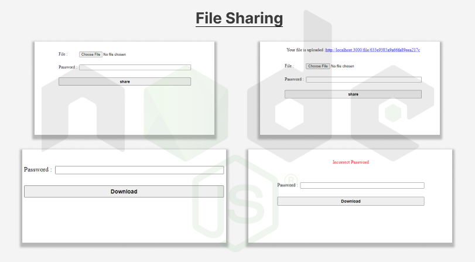

# Protected File Sharing

## Using Nodejs

### Modules Used..

-   Nodejs
-   ejs
-   express
-   bcrypt
-   dotenv
-   multer
-   nodemon
-   mongoose

### database

-   mongodb

## Snap 🤖 ...

## 🚀 About Me

I'm a Mern stack developer...

## 🔗 Links

